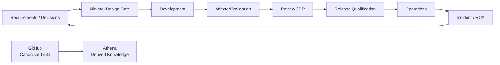

<h1 align="center">Engineering System</h1>

<p align="center">
  <strong>소프트웨어의 설계, 개발, 테스트, 릴리즈, 운영, 개선 전 과정을 위한 canonical AI-assisted engineering lifecycle.</strong>
</p>

<p align="center">
  작은 고신호 컨텍스트, deterministic automation, 그리고 사람의 최종 의사결정을 중심으로 설계했습니다.
</p>

<p align="center">
  <a href="README.md">English</a> · <strong>한국어</strong> · <a href="https://engineering.datarelay.run/ko">Human Handbook</a>
</p>

<p align="center">
  <strong>실 사례:</strong> <a href="https://engineering.datarelay.run/ko">engineering.datarelay.run</a>
</p>

<p align="center">
  <a href="https://github.com/datarelay-labs/engineering-system/actions/workflows/validate.yml"></a>
  
  
  
</p>

---

## 한 문장으로 시작

> **이 프로젝트에 https://github.com/datarelay-labs/engineering-system 을 적용해줘.**

신규 프로젝트든 기존 프로젝트든 이 문장이 기본 adoption entrypoint입니다.

AI는 먼저 repository를 조사하고, project-specific invariant를 보존하며, 실제 test/CI를 찾아낸 뒤, 현재 프로젝트와 충돌하지 않는 최소한의 Engineering System surface만 적용해야 합니다. 안전하게 판단할 수 없는 항목은 추측하지 않고 fail-closed로 멈춥니다.

목표는 기존 프로젝트의 engineering 현실을 덮어쓰는 것이 아닙니다. 그 현실을 **명시적이고, 반복 가능하고, 검증 가능하며, AI가 정확히 소비할 수 있는 형태**로 만드는 것입니다.

## 무엇을 제공하는가

| 기능 | 제공하는 것 |
|---|---|
| **Repository-aware adoption** | 기존 rule, test, CI, release, operations 신호를 먼저 조사한 뒤 적용 |
| **Minimal AI context** | 현재 작업에 필요한 repository entrypoint와 standard만 로드 |
| **Affected-test-first validation** | broad suite 전에 오류를 가장 싸고 빠르게 증명할 deterministic check부터 실행 |
| **Session continuity** | 긴 handoff prompt 대신 GitHub의 repository-scoped AI Work Packet에 현재 구현 상태 유지 |
| **Review discipline** | 사람 또는 자동 reviewer의 actionable finding을 수정하거나 근거와 함께 disposition하기 전에는 완료 처리하지 않음 |
| **Release qualification** | 빠른 PR feedback과 비싼 release-candidate qualification을 분리하고 exact-HEAD evidence 요구 |
| **Operations feedback loop** | incident, regression, 운영 장애를 test/runbook/RCA/ADR/requirement로 환류 |
| **Knowledge boundaries** | GitHub는 canonical로 유지하고 Athena와 사람용 문서는 derived/searchable layer로 사용 |

## 전체 Lifecycle



Product scope, 최종 의사결정, release 승인, human UX 판단은 Owner에게 남습니다. AI는 engineering process를 지원하지만 product scope를 임의로 확장하지 않습니다.

## 빠른 시작

### 1. Read-only adoption audit

```bash
python tools/adopt.py --root /path/to/project --audit
```

### 2. Managed adoption

Repository-specific rule, test, CI ownership을 확인한 뒤:

```bash
python tools/adopt.py \
  --root /path/to/project \
  --apply \
  --ack-rule-review \
  --ci-mode shared \
  --test-command "<project-native test command>"
```

이미 성숙한 project-native CI가 있다면 같은 검증을 중복으로 추가하지 말고 ownership을 명시적으로 mapping합니다.

### 3. Adoption qualification

```bash
python tools/check-adoption.py --root /path/to/project
```

파일이 생겼다는 이유만으로 adoption이 PASS가 되는 것은 아닙니다. 구조 검증과 필요한 project-native smoke/affected evidence가 실제로 성공해야 합니다.

## 기본 실행 모델

```text
change
 -> affected tests
 -> cheap deterministic PR guardrails
 -> review feedback handled
 -> merge

release candidate
 -> fast release preflight
 -> full deterministic qualification
 -> lifecycle / platform
 -> performance / resilience
 -> operational E2E
 -> exact-HEAD release
```

일반 PR마다 multi-hour full suite를 돌리지 않습니다. 이미 blocking deterministic failure가 존재하면 비싼 downstream qualification을 계속 실행하지 않습니다.

## Canonical Standards

| 영역 | Canonical standard |
|---|---|
| Core lifecycle, 역할, Definition of Done | [`standards/CORE.md`](standards/CORE.md) |
| Minimal design gate | [`standards/DESIGN.md`](standards/DESIGN.md) |
| 개발, 버그, refactor, compatibility, migration, dependency | [`standards/DEVELOPMENT.md`](standards/DEVELOPMENT.md) |
| Quality, regression, UX, compatibility, performance/resilience | [`standards/QUALITY.md`](standards/QUALITY.md) |
| Test level, affected selection, trigger semantics | [`standards/TESTING.md`](standards/TESTING.md) |
| Security, secret, dependency/OSS/supply chain | [`standards/SECURITY.md`](standards/SECURITY.md) |
| Version, artifact, qualification, upgrade, rollback | [`standards/RELEASE.md`](standards/RELEASE.md) |
| Operations, observability, backup/restore, incident, DR | [`standards/OPERATIONS.md`](standards/OPERATIONS.md) |
| Product Master/OpenSpec/ADR/Wiki source-of-truth 역할 | [`standards/KNOWLEDGE.md`](standards/KNOWLEDGE.md) |
| AI session continuity와 repository-scoped Work Packet | [`standards/SESSION_CONTINUITY.md`](standards/SESSION_CONTINUITY.md) |
| Automated repository adoption과 qualification | [`standards/ADOPTION.md`](standards/ADOPTION.md) |
| Core/adapters와 deterministic enforcement | [`standards/ENFORCEMENT.md`](standards/ENFORCEMENT.md) |

## Core와 Adapters

Core standard는 특정 AI 도구에 종속되지 않습니다. Tool-specific instruction은 adapter입니다.

자세한 내용은 [`adapters/README.md`](adapters/README.md)를 참고합니다.

Managed adoption이 적용된 repository는 일반적으로 다음 surface를 가집니다.

```text
AGENTS.md
.engineering/project.yaml
.engineering/tests.yaml
.engineering/release.yaml
.cursor/rules/engineering-system.mdc
.cursor/commands/resume.md
.github/ISSUE_TEMPLATE/ai-work-packet.md
.github/workflows/engineering-system.yml
```

Canonical standard보다 유효하거나 더 엄격한 project-specific rule은 보존합니다.

## Context Rule

항상 먼저 로드:

```text
AGENTS.md
.engineering/project.yaml
```

그 다음 현재 작업에 필요한 test/release metadata와 관련 standard/specification만 읽습니다.

Engineering System 전체, Wiki 전체, 과거 대화, 현재 작업과 무관한 프로젝트 컨텍스트를 기본으로 preload하지 않습니다.

## Source of Truth

> **GitHub is normative. Wiki/Athena is derived/searchable knowledge.**

Code, test, specification, commit, PR, CI evidence, release evidence, accepted durable decision은 canonical Git/GitHub artifact에 남습니다.

Athena와 [사람용 handbook](https://engineering.datarelay.run/ko)은 이 지식을 사람이 탐색하고 AI가 검색하기 쉽게 만드는 layer이며 canonical repository state를 덮어쓰지 않습니다.

## 설계 원칙

- Solo developer가 AI-assisted development에 매일 사용할 수 있을 만큼 가볍게 유지합니다.
- Custom platform보다 기존 GitHub와 project-native capability를 우선합니다.
- 반복 수작업을 없애거나 correctness를 명확히 높이는 경우에만 process/tooling을 추가합니다.
- 더 엄격한 project-specific invariant는 보존합니다.
- Ambiguous하거나 destructive한 결정은 fail-closed로 처리합니다.
- PASS를 얻기 위해 enforcement나 validation을 약화하지 않습니다.
- 다른 source revision의 historical PASS evidence를 재사용하지 않습니다.

---

<p align="center">
  <strong>대화는 임시적입니다. 지속되어야 하는 engineering state는 repository에 남습니다.</strong>
</p>

<p align="center">
  시작: <a href="standards/CORE.md"><code>standards/CORE.md</code></a> ·
  Adoption: <a href="standards/ADOPTION.md"><code>standards/ADOPTION.md</code></a> ·
  Handbook: <a href="https://engineering.datarelay.run/ko">engineering.datarelay.run/ko</a>
</p>
