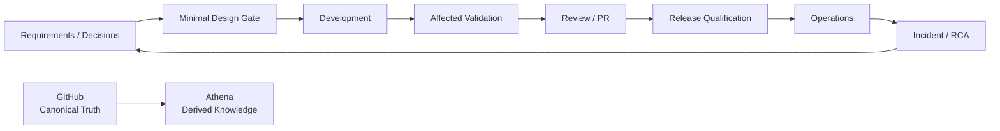

<h1 align="center">Engineering System</h1>

<p align="center">
  <strong>A canonical AI-assisted engineering lifecycle for designing, building, testing, releasing, operating, and evolving software.</strong>
</p>

<p align="center">
  Optimized for small, high-signal context, deterministic automation, and human-controlled product decisions.
</p>

<p align="center">
  <strong>English</strong> · <a href="README.ko.md">한국어</a> · <a href="https://engineering.datarelay.run">Human Handbook</a>
</p>

<p align="center">
  <strong>Real-world example:</strong> <a href="https://engineering.datarelay.run">engineering.datarelay.run</a>
</p>

<p align="center">
  <a href="https://github.com/datarelay-labs/engineering-system/actions/workflows/validate.yml"></a>
  
  
  
</p>

---

## Start with one instruction

> **Apply https://github.com/datarelay-labs/engineering-system to this project.**

That is the intended adoption entrypoint for a new or existing repository.

An AI agent should resolve the exact target repository, obtain the canonical Engineering System from the supplied URL, pin an immutable canonical baseline SHA, inventory the repository, preserve project-specific invariants, discover project-native tests and CI, apply the smallest compatible Engineering System surfaces, and fail closed when a decision cannot be inferred safely.

The target repository does not need to contain `tools/adopt.py` beforehand. The agent may use an authenticated GitHub integration or a separate temporary checkout of the canonical repository, then run the helper against the target root. For a brand-new project, establish the Git repository boundary first; `--allow-no-tests` is only a temporary bootstrap state while no executable test target exists.

The goal is not to replace a project's engineering reality. The goal is to make that reality **explicit, repeatable, testable, and easy for AI agents to consume**.

## What this system does

| Capability | What it provides |
|---|---|
| **Repository-aware adoption** | Inventories rules, tests, CI, release and operations signals before installing anything |
| **Minimal AI context** | Loads only the repository entrypoints and standards relevant to the current task |
| **Affected-test-first validation** | Uses the cheapest deterministic check that can disprove correctness before broad suites |
| **Session continuity** | Keeps active implementation state in repository-scoped GitHub AI Work Packets; Work Packet v2 binds the current owner intent and task kind to the next action instead of relying on giant handoff prompts |
| **Review discipline** | Requires actionable human or automated review feedback to be fixed or explicitly dispositioned before completion |
| **Release qualification** | Separates fast PR feedback from expensive release-candidate qualification and requires exact-HEAD evidence |
| **Operations feedback loop** | Feeds incidents, regressions and operational failures back into tests, runbooks, RCA, ADR or requirements |
| **Knowledge boundaries** | Keeps GitHub canonical while Athena and human-readable documentation remain derived/searchable layers |

## The lifecycle



The owner retains product scope, final decisions, release approval, and human UX judgment. AI agents assist the engineering process; they do not silently broaden product scope.

## Quick start

### 1. Read-only adoption audit

```bash
python tools/adopt.py --root /path/to/project --audit
```

### 2. Managed adoption

After repository-specific rules, tests and CI ownership have been reviewed, the canonical helper installs only missing managed surfaces and pins the exact canonical baseline:

```bash
python tools/adopt.py \
  --root /path/to/project \
  --apply \
  --ack-rule-review \
  --ci-mode shared \
  --test-command "<project-native test command>"
```

If the repository already has mature native CI, map that ownership explicitly instead of adding a duplicate shared gate.

Engineering System 1.6.4 adds token-efficient Cursor operation on top of the 1.6.x adoption/release contracts: the always-applied Cursor rule is intentionally compact, existing PR work starts from the Git diff, test manifests may declare cost/timeout/default metadata, `tools/engineering-test.py` selects the cheapest safe affected check, verbose command output is bounded, new adoptions receive conservative `.cursorignore` defaults, and each new bounded Work Packet action prefers a fresh coding-agent session. Managed upgrades synchronize only known-managed Cursor rules and preserve custom `.cursorignore` content. Adopted repositories still pin `engineering_system.version` plus an immutable `engineering_system.baseline` SHA; org-wide rollout targets that exact baseline rather than version alone.

Engineering System 1.6.5 adds a deterministic Cursor persistent-session resource guard. Before `agent persist`, run `python3 tools/cursor-resource-preflight.py`. Exit 0 is `PASS` or `WARN` and may proceed; a non-zero `BLOCK` refuses only the new session and never stops existing sessions. Thresholds scale for small, medium, and large hosts, with a host-local override outside the repository. Resource safety takes precedence over preferring a fresh session.

### 3. Qualify the adoption

```bash
python tools/check-adoption.py --root /path/to/project
```

Adoption is not PASS because files exist. Structural validation and the required project-native smoke/affected evidence must succeed.

Existing managed 1.5+ repositories upgrade through the fail-closed `tools/upgrade-adoption.py` path rather than blindly rerunning initial bootstrap. Once adoption is qualified, feature, bugfix, testing, review, release, operations, incident, and retirement work automatically route through the repository entrypoint, project metadata, relevant canonical standard, and deterministic evidence; there is no separate lifecycle activation step.

## Default execution model

```text
change
 -> affected tests
 -> cheap deterministic PR guardrails
 -> review feedback handled
 -> merge

release candidate
 -> fast release preflight
 -> full deterministic qualification
 -> lifecycle / platform
 -> performance / resilience
 -> operational E2E
 -> exact-HEAD release
```

Do not run multi-hour full suites on every PR. Do not continue expensive downstream qualification while a known blocking deterministic failure exists.

## Canonical standards

| Domain | Canonical standard |
|---|---|
| Core lifecycle, roles, Definition of Done | [`standards/CORE.md`](standards/CORE.md) |
| Minimal design gate | [`standards/DESIGN.md`](standards/DESIGN.md) |
| Development, bugs, refactor, compatibility, migration, dependencies | [`standards/DEVELOPMENT.md`](standards/DEVELOPMENT.md) |
| Quality, regression, UX, compatibility, performance/resilience | [`standards/QUALITY.md`](standards/QUALITY.md) |
| Test levels, affected selection, trigger semantics | [`standards/TESTING.md`](standards/TESTING.md) |
| Security, secrets, dependency/OSS/supply chain | [`standards/SECURITY.md`](standards/SECURITY.md) |
| Version, artifacts, qualification, upgrade, rollback | [`standards/RELEASE.md`](standards/RELEASE.md) |
| Operations, observability, backup/restore, incidents, DR | [`standards/OPERATIONS.md`](standards/OPERATIONS.md) |
| Product Master/OpenSpec/ADR/Wiki source-of-truth roles | [`standards/KNOWLEDGE.md`](standards/KNOWLEDGE.md) |
| AI session continuity and repository-scoped Work Packets | [`standards/SESSION_CONTINUITY.md`](standards/SESSION_CONTINUITY.md) |
| Automated repository adoption and qualification | [`standards/ADOPTION.md`](standards/ADOPTION.md) |
| Core/adapters and deterministic enforcement | [`standards/ENFORCEMENT.md`](standards/ENFORCEMENT.md) |

## Core and adapters

The core standard is tool-agnostic. Tool-specific instructions are adapters.

See [`adapters/README.md`](adapters/README.md).

A managed adopted repository normally contains:

```text
AGENTS.md
.engineering/project.yaml
.engineering/tests.yaml
.engineering/release.yaml
.cursor/rules/engineering-system.mdc
.cursor/commands/resume.md
.github/ISSUE_TEMPLATE/ai-work-packet.md
.github/workflows/engineering-system.yml
```

Project-specific rules that are valid or stricter than the canonical standard are preserved.

## Context rule

Always load:

```text
AGENTS.md
.engineering/project.yaml
```

Then load test/release metadata and only the standards or specifications relevant to the task.

Do **not** preload the entire Engineering System, Wiki, historical discussions, or unrelated project context.

## Source of truth

> **GitHub is normative. Wiki/Athena is derived/searchable knowledge.**

Code, tests, specifications, commits, PRs, CI evidence, release evidence, and accepted durable decisions belong in canonical Git/GitHub artifacts.

Athena and the [human handbook](https://engineering.datarelay.run) make that knowledge easier to navigate and search, but they do not override canonical repository state.

## Design principles

- Keep the system lightweight enough for a solo developer using AI-assisted development.
- Prefer existing GitHub and project-native capabilities over custom platforms.
- Add process only when it removes repeated manual work or materially improves correctness.
- Preserve stricter project-specific invariants.
- Fail closed on ambiguous or destructive decisions.
- Never weaken enforcement or validation merely to obtain PASS.
- Never reuse historical PASS evidence for a different source revision.

---

<p align="center">
  <strong>Conversation is temporary. Durable engineering state belongs in the repository.</strong>
</p>

<p align="center">
  Start with <a href="standards/CORE.md"><code>standards/CORE.md</code></a> ·
  Adoption: <a href="standards/ADOPTION.md"><code>standards/ADOPTION.md</code></a> ·
  Handbook: <a href="https://engineering.datarelay.run">engineering.datarelay.run</a>
</p>
